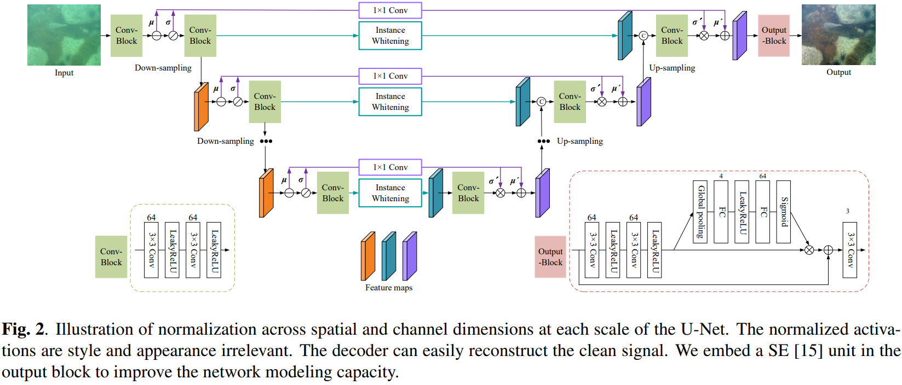

# SCNet
Underwater Image Enhancement via Learning Water Type Desensitized Representations. Accepted by ICASSP 2022. [[paper](https://arxiv.org/abs/2102.00676)]

<div align=center></div>

You can run eval.py and to obtain the results using our pre-trained model [[Baidu Drive](https://pan.baidu.com/s/1sQ_j-6A7EhNPJF7r9KWsRw)(9xwn)] [[Google Drive](https://drive.google.com/file/d/1kHOPSUObw7FafI6_xgaD9kCZ5U5JzIsc/view?usp=sharing)].

You can run get_performance.py to obtian the SSIM, PSNR and LPIPS scores.

To train the model, you need to prepare the dataset first [[Baidu Drive](https://pan.baidu.com/s/1LNh4XjePRw96-Jh-IDOkHw)(qwat)] [[(Google Drive)](https://drive.google.com/file/d/1DBCXCa5GWJPB7S6xO7f0N562FqXhsV6c/view?usp=sharing)]. Then, run main.py.

If you find SCNet is useful in your research, please consider citing our paper.
```
@INPROCEEDINGS{9747758,
  author={Fu, Zhenqi and Lin, Xiaopeng and Wang, Wu and Huang, Yue and Ding, Xinghao},
  booktitle={ICASSP 2022 - 2022 IEEE International Conference on Acoustics, Speech and Signal Processing (ICASSP)}, 
  title={Underwater Image Enhancement Via Learning Water Type Desensitized Representations}, 
  year={2022},
  pages={2764-2768},
  doi={10.1109/ICASSP43922.2022.9747758}}
```
